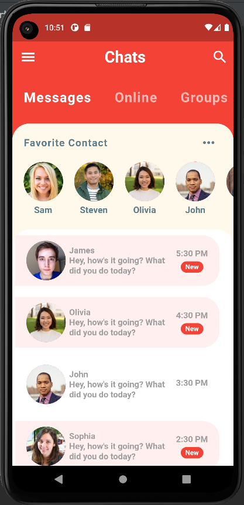
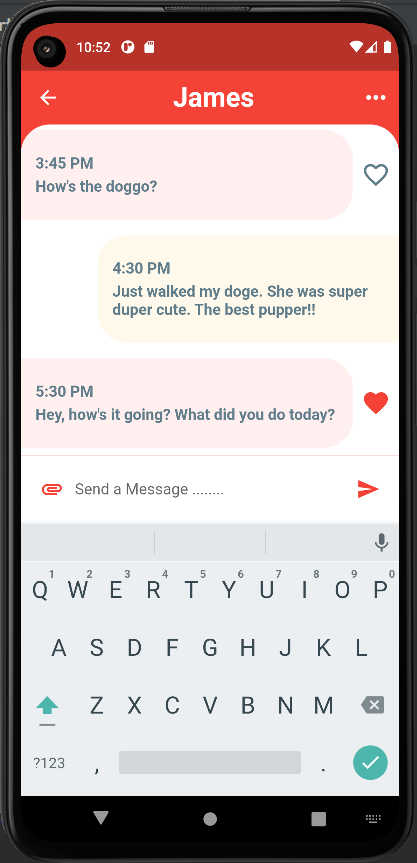
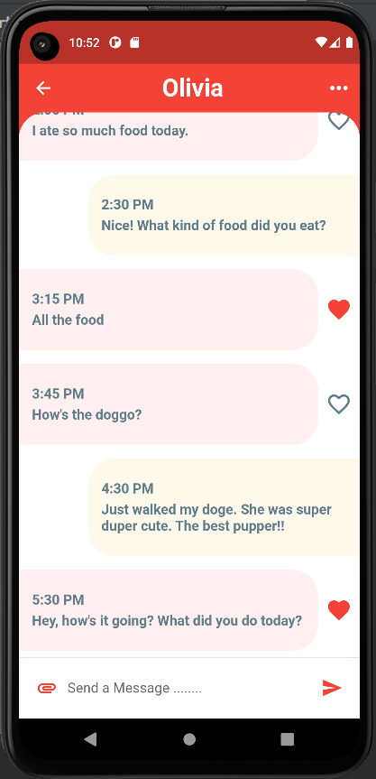
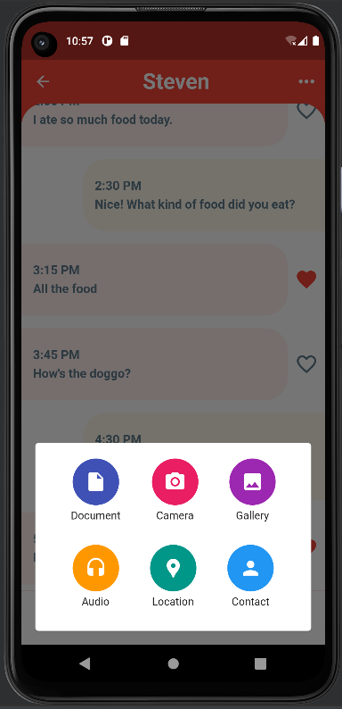

# 📱 Flutter Advanced Chat UI (2022)

A modern, highly polished, and responsive Chat Application Interface built using **Flutter** and **Dart**. This project focuses on delivering a smooth user experience (UX) with premium UI design, featuring intricate navigation, message bubbles, and custom interactive action sheets.

---

### 🛠️ Key UI/UX Features
* **Modern Chat Dashboard:** Clean layout displaying messages, active/online users, and groups.
* **Premium Conversation UI:** Elegant message bubbles with custom input bars and action behaviors.
* **Custom Media Attachment Sheet:** A fluid menu option enabling users to attach files, images, capture photos, and share locations seamlessly.
* **Responsive Design:** Optimized layout that feels native and responsive across multiple device screen sizes.

---

### 📸 UI Screenshots

Here is a showcase of the application's visual interface and typography:

  
  
  
  

